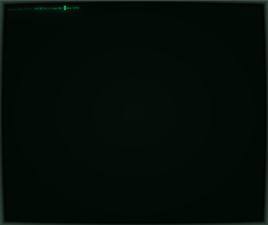
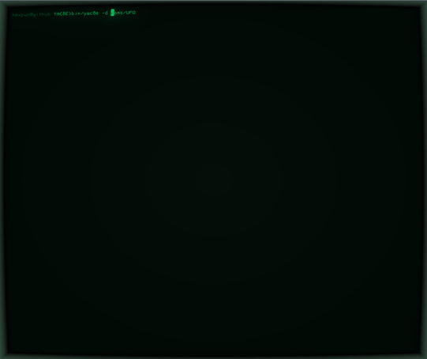

# YAC8E - Yet Another Chip-8 Emulator

¯\\\_(ツ)\_/¯

## About

Yet another [Chip-8](http://devernay.free.fr/hacks/chip8/C8TECH10.HTM) emulator. 

Created as a C **programming exercise** using the bare minimal of libraries (no SDL, only `ncurses` and `pthreads`).  Don't judge...

For extra flair, use with `cool-retro-terminal` (https://github.com/Swordfish90/cool-retro-term)

*Tested only on Linux... probably will not build on Windows because of `pthreads`* 

## How to run

* Compile using `gcc` by running `make`. 

* Run the executable `yac8e <rom_filename>` with a chosen ROM. 

Example:

`./yac8e roms/UFO`

#### Optional debug flag

`./yac8e -d <rom_file>` for debug mode.

## TO-DOs

* Cleanup code; split gigantic file...
* Solve the multithreading blocking issue when multiple keystrokes are given at once
* Find a more elegant solution for the clock rate, possibly give the use the chance to change clock rate mid-game
* Game selection menu
* Reset game command